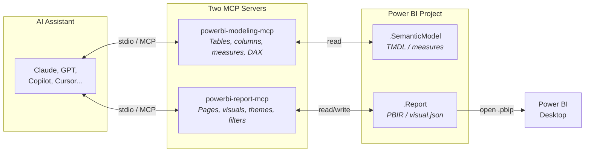
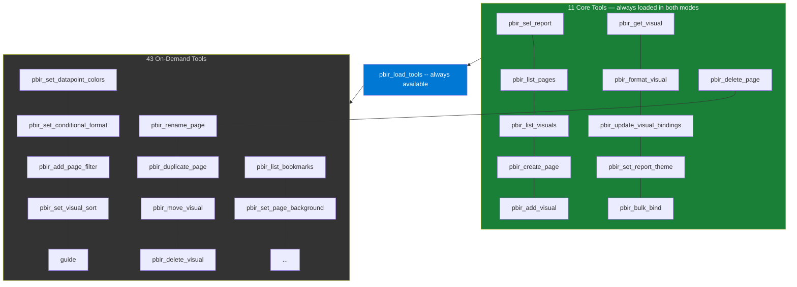

<!-- doc-version: 1.6 | Last updated: 2026-05-02 -->
<p align="center">
  <h1 align="center">Power BI Report MCP Server</h1>
  <p align="center">
    Build Power BI reports with natural language — currently tested with Claude (Code, Desktop, Cowork).
  </p>
</p>

<p align="center">
  <a href="LICENSE"></a>
  
  
  
  
  
</p>

<p align="center">
  <strong>Tested:</strong> <code>Claude Code</code> &middot; <code>Claude Desktop</code> &middot; <code>Claude Cowork</code><br>
  <em>Built on the standard MCP protocol — other MCP-compatible clients should work but are not yet verified.</em>
</p>

---

> **"Create an executive summary page with 6 KPI cards, a revenue trend line chart, and a bar chart by country"**
>
> One prompt. One batch call. Full page in Power BI Desktop.

<!-- TODO: add hero screenshot of a generated report page in Power BI Desktop -->

---

### What's new in 0.8

- **`pbir_` tool prefix** — every tool name now starts with `pbir_` to avoid collisions with sibling MCP servers in the same session
- **Cowork plugin** — drop a single `.plugin` file into Claude (no terminal, no Node install) — see [Quick Start › Cowork plugin](#3b-cowork-plugin)
- **`registerTool` migration** — modern MCP SDK entrypoint with structured `outputSchema` on every read tool
- **Typo catcher + auto-pageId** — fewer "did you mean…" round-trips when there's only one page
- **Tighter `outputSchema` (v0.8.2)** — 14 read tools now ship per-tool zod response schemas; mutation tools keep the loose envelope

Full details: **[CHANGELOG.md](CHANGELOG.md)**.

---

## What is this?

The first open-source **MCP server for Power BI report authoring**. It connects Claude (or any MCP-compatible client — see [Tested clients](#tested-clients)) to Power BI's PBIR (Power BI Report) file format, turning natural language into real report pages — cards, charts, tables, themes, filters, and formatting.

No REST API keys. No Power BI service. Just local files + Claude.

```
You: "Build me a sales dashboard with KPIs, trend charts, and a detail table"

AI:  pbir_create_page → pbir_add_visual (batch: 12 visuals) → pbir_set_report_theme → done.
     Open in Power BI Desktop. ✓
```

---

## Why MCP?

**MCP (Model Context Protocol)** is an open standard that lets AI assistants call external tools. Instead of the AI generating code for you to run, it directly executes operations through the MCP server.



**The typical workflow:**

```
1. Query the model   --> "What tables and measures are available?"    (modeling-mcp)
2. Build the report  --> "Create a dashboard with those measures"     (report-mcp)
3. Open in Desktop   --> Ctrl+Shift+F5 to refresh
```

> Both servers run simultaneously as MCP tools. The AI queries the semantic model for exact table/column/measure names, then uses those to build correctly-bound report pages — no guessing, no broken fields.

**Zero vendor lock-in** — built on `@modelcontextprotocol/sdk` + `zod`. No Anthropic, OpenAI, or Microsoft SDK imports.

---

## How It Compares

| | **This MCP Server** | **Manual PBI Desktop** | **Power BI REST API** | **pbi-tools** |
|---|---|---|---|---|
| **Input** | Natural language | Mouse clicks | REST calls + auth | CLI commands |
| **Speed** | 10-page report in minutes | Hours | Hours (code-heavy) | Minutes (extract/deploy) |
| **Auth required** | None (local files) | None | Azure AD + Service Principal | None |
| **AI-native** | Yes (MCP) | No | No | No |
| **Format** | PBIR (file-based) | PBIX (binary) | Cloud-only | PBIX ↔ folder |
| **Creates visuals** | Yes | Yes | Limited | No (metadata only) |
| **Themes & formatting** | Yes | Yes | Limited | No |
| **Filters** | Yes | Yes | Yes | No |
| **Works offline** | Yes | Yes | No | Yes |

---

## Quick Start

> Full walkthrough: **[docs/quickstart.md](docs/quickstart.md)**

### 1. Install

```bash
git clone https://github.com/jonathan-pap/powerbi-report-mcp.git
cd powerbi-report-mcp
npm install
npm run build
```

### 2. Configure your MCP client

Ready-to-use config files are in the **[configs/](configs/)** folder — copy the one for your client, update the path, done.

| Config | Client | Copy to |
|--------|--------|---------|
| [`claude-desktop.json`](configs/claude-desktop.json) | Claude Desktop | `%LOCALAPPDATA%\...\Claude\claude_desktop_config.json` |
| [`cursor.json`](configs/cursor.json) | Cursor | `~/.cursor/mcp.json` |
| [`vscode-copilot.json`](configs/vscode-copilot.json) | GitHub Copilot | `.vscode/mcp.json` |
| [`windsurf.json`](configs/windsurf.json) | Windsurf | `~/.windsurf/mcp.json` |
| [`continue-dev.json`](configs/continue-dev.json) | Continue.dev | `~/.continue/config.json` |
| [`cline.json`](configs/cline.json) | Cline | VS Code Settings → MCP Servers |

**Claude Code** (no config file needed):

```bash
claude mcp add powerbi-report-mcp node C:\path\to\powerbi-report-mcp\dist\index.js
```

> Each config includes both **powerbi-report-mcp** and **powerbi-modeling-mcp** for full dual-layer access. See [configs/README.md](configs/README.md) for optional settings (pre-connect to a report, load all tools at startup).

### 3b. Cowork plugin

Prefer to skip the `git clone`/`npm install` dance? Grab the latest **`.plugin`** bundle from [GitHub Releases](https://github.com/jonathan-pap/powerbi-report-mcp/releases) and drag it into Claude — the plugin ships the server, skills, and a default MCP wiring in one file.

| Step | Action |
|------|--------|
| 1 | Download `powerbi-report-builder-<version>.plugin` from [the latest release](https://github.com/jonathan-pap/powerbi-report-mcp/releases/latest) |
| 2 | Open Claude → **Settings → Plugins → Install from file** (or drag-and-drop the `.plugin` onto the Claude window) |
| 3 | Approve the bundled MCP server when prompted |
| 4 | In any Claude conversation: *"Connect to C:\\Projects\\Sales.Report and list pages"* |

<!-- TODO: add screenshot/gif of dragging the .plugin into Claude and the install prompt -->

> Cowork is a hosted Claude experience with native plugin support. The plugin bundle is a single zip; nothing leaves your machine and the MCP server still runs locally over stdio.

### 3. Connect and build

```
Connect to C:\Projects\Sales.Report
Create a page called "Overview" with 4 KPI cards and a bar chart by country
```

### 4. Open in Power BI Desktop

Open the `.pbip` file — or if already open, press `Ctrl+Shift+F5` to refresh.

### Headless / eval mode

For automated/eval use you can auto-bind a report at startup with the `PBIR_REPORT_PATH` env var instead of calling `pbir_set_report`:

```bash
PBIR_REPORT_PATH=evals/fixtures/sample.Report node dist/index.js
```

If the path is invalid the server logs to stderr and continues running unbound (use `pbir_set_report` to recover). The CLI arg form (`node dist/index.js <path>`) still works and wins when both are set.

---

## Smart Tool Loading

By default all **56 tools load at startup** — this is the most compatible configuration, and what you want for Claude Desktop and most other MCP clients whose tool catalog is a snapshot taken at session start.

For token-sensitive setups (e.g. Claude Code with large prompt budgets on dev machines), you can opt into the **minimal** mode — only **12 core tools** load at startup, and the LLM activates more on-demand via `pbir_load_tools`:

```json
"env": { "MCP_TOOLS": "minimal" }
```



| Mode | Tools at Startup | Token Overhead | Use Case |
|------|------------------|----------------|----------|
| `default` | 56 + `pbir_load_tools` | ~16,500 tokens | Claude Desktop, most clients, first-time users |
| `MCP_TOOLS=minimal` | 12 + `pbir_load_tools` | **~3,400 tokens** | Claude Code / clients that refresh the tool list mid-session |
| `MCP_TOOLS=all` *(legacy alias)* | 56 + `pbir_load_tools` | ~16,500 tokens | Same as default; kept for backward-compat |

> Default is "load everything" because Claude Desktop snapshots the MCP tool catalog at session start and never refreshes it — tools activated mid-session via `pbir_load_tools` would otherwise be invisible to the model. Clients that honour `tools/list_changed` notifications (Claude Code, Cowork) can opt into `MCP_TOOLS=minimal` to claw back ~13k tokens.

---

## Tool Reference

### Default Tools

| Tool | Description |
|------|-------------|
| `pbir_set_report` | Connect to a `.Report` folder at runtime |
| `pbir_list_pages` | List all pages (id, name, visual count) |
| `pbir_list_visuals` | List visuals on a page (id, type, position, title) |
| `pbir_create_page` | Create a new page |
| `pbir_add_visual` | Add one or many visuals with bindings, formatting, colors |
| `pbir_get_visual` | Inspect a visual's config and bindings |
| `pbir_format_visual` | Format axes, legend, labels, borders, background |
| `pbir_update_visual_bindings` | Replace data bindings on a visual |
| `pbir_set_report_theme` | Apply a custom JSON theme to the whole report |
| `pbir_bulk_bind` | Rebind multiple visuals in one call |
| `pbir_model_usage` | Cross-reference semantic model with report — three-tier classification (direct/indirect/unused), DAX lineage, UDF functions, conditional formatting detection |
| `pbir_load_tools` | List and activate on-demand tools |

#### Why `pbir_model_usage` is a default tool — the deletion fail-safe

`pbir_model_usage` ships in the default set (not on-demand) because it is the **safety layer** for AI-driven cleanup of the semantic model. When a user asks Claude to *"remove unused measures"* or *"clean up dead columns"*, the model would otherwise guess based on measure names and delete things blindly — and break visuals that depend on indirect references.

With `pbir_model_usage` always available, the LLM can call it first and see the full dependency picture before touching anything:

| Scenario | Without `pbir_model_usage` | With `pbir_model_usage` |
|---|---|---|
| User: *"delete all unused measures"* | LLM guesses by name, deletes `Margin Delta pp`, `Margin Arrow` breaks the next day | LLM sees `Margin Delta pp` is status `indirect` (referenced by `Margin Arrow`), keeps it, lists only the truly safe ones |
| User: *"is `Discount Arrow` used anywhere?"* | LLM greps the visual JSON, misses conditional formatting bindings | LLM sees it bound to `cardImage.imageData` / `referenceLabel.value` and reports exactly where |
| User: *"which UDF functions can I drop?"* | LLM has no lineage info | LLM sees reference counts per function and flags zero-reference functions |

The MCP tool gives **Claude** that understanding *before* it mutates anything — what prevents "oops" deletes. The tool returns a slim JSON response (~7K tokens) by default so it's cheap to call before every destructive operation.

### On-Demand Tools (43)

<details>
<summary><b>Report & Page Management</b> — 17 tools</summary>

| Tool | Description |
|------|-------------|
| `pbir_get_report` | Show connected report path |
| `pbir_reload_report` | Reopen report in PBI Desktop |
| `pbir_get_report_settings` | Read report-level settings |
| `pbir_update_report_settings` | Merge new report settings |
| `get_page_summary` | All pages + visuals in one call |
| `pbir_delete_page` | Delete a page and its visuals |
| `pbir_rename_page` | Rename a page |
| `pbir_duplicate_page` | Clone a page with all visuals |
| `pbir_reorder_pages` | Set page order |
| `pbir_set_active_page` | Set default page on open |
| `pbir_update_page_size` | Change page dimensions |
| `pbir_set_page_visibility` | Show/hide from navigation |
| `pbir_auto_layout` | Auto-arrange visuals in a grid |
| `pbir_set_filter_pane` | Show/hide and expand/collapse the filter pane |
| `pbir_set_page_background` | Set page canvas background color and/or wallpaper |
| `pbir_set_visual_interaction` | Set cross-filter/highlight interaction between visuals |
| `pbir_manage_extension_measures` | Add, list, or remove report-level DAX measures |
</details>

<details>
<summary><b>Visual Management</b> — 5 tools</summary>

| Tool | Description |
|------|-------------|
| `pbir_delete_visual` | Remove a visual |
| `pbir_duplicate_visual` | Clone a visual |
| `pbir_move_visual` | Reposition and resize |
| `pbir_change_visual_type` | Swap type, keep bindings |
| `pbir_get_visual_types` | List all visual types and buckets |
</details>

<details>
<summary><b>Formatting & Colors</b> — 6 tools</summary>

| Tool | Description |
|------|-------------|
| `pbir_set_visual_title` | Set title text, font, alignment |
| `pbir_set_datapoint_colors` | Per-series or per-category colors |
| `pbir_set_conditional_format` | Rules-based or gradient formatting |
| `pbir_set_visual_sort` | Set or change sort order (column/measure, ascending/descending) |
| `pbir_apply_theme` | Apply a preset theme to a page |
| `pbir_audit_theme_compliance` | Scan visuals for formatting overrides conflicting with theme |
</details>

<details>
<summary><b>Themes</b> — 4 tools</summary>

| Tool | Description |
|------|-------------|
| `pbir_get_report_theme` | Get current theme JSON |
| `pbir_remove_report_theme` | Revert to default theme |
| `pbir_list_report_themes` | List stored theme files |
| `pbir_diff_report_theme` | Compare proposed vs current theme |
</details>

<details>
<summary><b>Filters</b> — 4 tools</summary>

| Tool | Description |
|------|-------------|
| `pbir_list_filters` | List page or visual filters |
| `pbir_add_page_filter` | Add categorical, TopN, relative date, or advanced filter |
| `pbir_remove_filter` | Remove a filter by name |
| `pbir_clear_filters` | Remove all filters |
</details>

<details>
<summary><b>Bulk Operations</b> — 2 tools</summary>

| Tool | Description |
|------|-------------|
| `pbir_bulk_delete_visuals` | Delete multiple visuals |
| `pbir_bulk_update_format` | Format multiple visuals |
</details>

<details>
<summary><b>Bookmarks</b> — 4 tools</summary>

| Tool | Description |
|------|-------------|
| `pbir_list_bookmarks` | List all bookmarks in the report |
| `pbir_add_bookmark` | Create a new bookmark |
| `pbir_delete_bookmark` | Delete a bookmark |
| `pbir_rename_bookmark` | Rename a bookmark |
</details>

<details>
<summary><b>Knowledge Layer</b> — 1 tool</summary>

| Tool | Description |
|------|-------------|
| `pbir_guide` | Domain knowledge for PBI development — topics: `svg-visuals`, `report-design` |

The `pbir_guide` tool provides focused, actionable knowledge to help AI agents make better decisions. Instead of loading large skill files into every session, agents call `pbir_guide("topic")` on demand. The SVG visuals topic includes 4 DAX templates, binding rules, and workflow steps.
</details>

---

## Batch Mode — Build Pages Fast

Create an entire page in a single `pbir_add_visual` call:

```json
{
  "pageId": "abc123",
  "visuals": [
    {
      "visualType": "shape", "shapeType": "rectangle",
      "x": 0, "y": 0, "width": 1280, "height": 50,
      "fillColor": "#1F3864", "textContent": "Sales Dashboard",
      "textColor": "#FFFFFF", "textBold": true, "textSize": 20
    },
    {
      "visualType": "card",
      "x": 10, "y": 60, "width": 300, "height": 100,
      "title": "Revenue",
      "bindings": [
        { "bucket": "Fields", "fields": [{ "field": "Sales[Revenue]", "type": "measure" }] }
      ]
    },
    {
      "visualType": "clusteredBarChart",
      "x": 10, "y": 170, "width": 620, "height": 260,
      "title": "Revenue by Country",
      "bindings": [
        { "bucket": "Category", "fields": [{ "field": "Store[Country]", "type": "column" }] },
        { "bucket": "Y", "fields": [{ "field": "Sales[Revenue]", "type": "measure" }] }
      ],
      "dataColors": [{ "color": "#0078D4" }]
    }
  ]
}
```

> **One call creates the banner, KPI card, and chart — with data bindings, titles, and colors.**

<!-- TODO: add before/after wireframe → finished page screenshot for the batch example above -->

---

## Supported Visual Types

> Full reference: **[docs/visual-types.md](docs/visual-types.md)**

### Naming Gotchas

```
barChart              = Stacked bar       (NOT clustered)
columnChart           = Stacked column    (NOT clustered)
clusteredBarChart     = Clustered bar     ✓
clusteredColumnChart  = Clustered column  ✓
stackedBarChart       = DOES NOT EXIST    ✗ (use barChart)
scatterChart          = Uses "Details" bucket, NOT "Category"
Combo charts          = Use "ColumnY" + "LineY", NOT "Y" + "Y2"
```

### Quick Reference

| Category | Types |
|----------|-------|
| **Bar/Column** | `barChart` · `clusteredBarChart` · `columnChart` · `clusteredColumnChart` · `hundredPercentStackedBarChart` · `hundredPercentStackedColumnChart` |
| **Line/Area** | `lineChart` · `areaChart` · `stackedAreaChart` · `hundredPercentStackedAreaChart` |
| **Combo** | `lineClusteredColumnComboChart` · `lineStackedColumnComboChart` |
| **Pie/Donut** | `pieChart` · `donutChart` · `funnelChart` · `treemap` |
| **Tables** | `tableEx` · `pivotTable` (matrix) |
| **Cards** | `card` · `cardVisual` · `multiRowCard` · `kpi` · `gauge` |
| **Slicers** | `slicer` (Basic/Dropdown) · `listSlicer` · `textSlicer` · `advancedSlicerVisual` |
| **Maps** | `azureMap` · `map` · `filledMap` |
| **Scatter** | `scatterChart` |
| **Other** | `ribbonChart` · `waterfallChart` · `decompositionTreeVisual` |
| **Decorative** | `textbox` · `shape` · `image` · `actionButton` · `pageNavigator` |

---

## Formatting

```
pbir_format_visual(target="auto")          → auto-routes to container or visual (default)
pbir_format_visual(target="container")     → title, background, border, padding, shadow
pbir_format_visual(target="visual")        → axes, legend, labels, line styles, data points
```

<details>
<summary><b>Container properties</b> (visual chrome)</summary>

| Category | Properties |
|----------|-----------|
| `title` | `text`, `show`, `fontSize`, `fontFamily`, `alignment`, `fontColor` |
| `background` | `show`, `color`, `transparency` |
| `border` | `show`, `color`, `width`, `radius` |
| `padding` | `top`, `bottom`, `left`, `right` |
| `dropShadow` | `show`, `position` |
| `visualHeader` | `show` |
</details>

<details>
<summary><b>Visual properties</b> (chart content)</summary>

| Category | Properties | Applies To |
|----------|-----------|-----------|
| `categoryAxis` | `show`, `labelColor`, `fontSize` | Bar, column, line, combo |
| `valueAxis` | `show`, `labelColor`, `fontSize` | Bar, column, line, combo |
| `legend` | `show`, `position`, `labelColor` | Charts with Series |
| `labels` | `show`, `color`, `fontSize` | Most charts |
| `lineStyles` | `strokeWidth`, `lineChartType` | Line, area, combo |
| `dataPoint` | `fillTransparency` | Most charts |
</details>

> Hex colors starting with `#` are automatically wrapped in PBIR format.

---

## Themes & Conditional Formatting

### Report-Level Theme

```json
{
  "name": "Corporate Brand",
  "dataColors": ["#0078D4", "#00BCF2", "#00B294", "#FF8C00", "#E81123"],
  "background": "#FFFFFF",
  "foreground": "#1F3864",
  "tableAccent": "#0078D4"
}
```

### Gradient Conditional Format

```json
{
  "formatType": "gradient",
  "entity": "Sales", "property2": "Revenue", "isMeasure": true,
  "minColor": "#FF6B6B", "midColor": "#FFD93D", "maxColor": "#6BCB77"
}
```

### Page Themes (presets)

`dark` · `light` · `corporate` · `blue-purple`

---

## Filters

```json
// Categorical — include specific values
{ "filterType": "categorical", "entity": "Store", "property": "Region", "values": ["East", "West"] }

// TopN — top 10 products (visual-level only)
{ "filterType": "topN", "entity": "Product", "property": "Name", "n": 10,
  "topNDirection": "Top", "orderByEntity": "Sales", "orderByProperty": "Revenue",
  "orderByIsMeasure": true, "visualId": "xyz" }

// Relative date — last 12 months
{ "filterType": "relativeDate", "entity": "Date", "property": "Date",
  "period": "months", "count": 12, "dateDirection": "last" }
```

---

## Architecture

```
powerbi-report-mcp/
├── src/
│   ├── index.ts              # Server entry, smart tool loading, safe() wrapper
│   ├── pbir.ts               # PbirProject — PBIR file I/O abstraction
│   ├── context.ts            # ServerContext interface
│   ├── model-usage.ts        # Model usage analysis — three-tier classification, UDF parsing, conditional formatting
│   ├── tools/
│   │   ├── report.ts         # Page & report management (20 tools)
│   │   ├── visuals.ts        # Visual CRUD (8 tools)
│   │   ├── format.ts         # Formatting, sort & colors (6 tools)
│   │   ├── bindings.ts       # Data binding (1 tool)
│   │   ├── themes.ts         # Report themes (6 tools)
│   │   ├── filters.ts        # Page/visual filters (4 tools)
│   │   ├── bulk.ts           # Bulk operations (3 tools)
│   │   ├── bookmarks.ts      # Bookmark CRUD (4 tools)
│   │   └── guide.ts          # Knowledge layer (1 tool, 2 topics)
│   └── helpers/
│       ├── createVisual.ts   # Visual creation engine
│       ├── formatting.ts     # PBIR formatting builder
│       └── defaults.ts       # Theme presets
├── .usage/                   # Generated usage dashboards (gitignored)
├── dist/                     # Compiled JS (committed for no-build deploy)
├── pbi report/               # Sample report (financials model)
├── docs/                     # Guides and references
└── skills/                   # LLM skill documents
```

> Full details: **[ARCHITECTURE.md](ARCHITECTURE.md)**

### Data Flow


---

## PBIR Folder Structure

```
MyProject.Report/
  definition/
    report.json                 # Report settings, theme config
    pages/
      pages.json                # Page order and active page
      {pageId}/
        page.json               # Page name, size, visibility
        visuals/
          {visualId}/
            visual.json         # Type, position, bindings, formatting
  StaticResources/
    RegisteredResources/        # Custom theme JSON files
  definition.pbir               # Semantic model reference
```

---

## Token Efficiency

| Mode | Tools Loaded | Tokens/Turn | Cost per 10-Page Report |
|------|-------------|-------------|------------------------|
| **Default** | 11 | ~3,100 | $0.01 – $0.45 |
| **All** | 48 | ~14,500 | $0.02 – $2.50 |

<details>
<summary><b>Detailed API cost breakdown (April 2026 pricing)</b></summary>

| Model | Input $/1M | Output $/1M | Base Report | Fully Styled |
|-------|-----------|-------------|-------------|--------------|
| GPT-4o-mini | $0.15 | $0.60 | **$0.01** | $0.02 |
| GPT-4.1-mini | $0.40 | $1.60 | **$0.02** | $0.05 |
| GPT-4.1 | $2.00 | $8.00 | **$0.11** | $0.25 |
| GPT-4o | $2.50 | $10.00 | **$0.14** | $0.32 |
| Claude Haiku 3.5 | $0.80 | $4.00 | **$0.05** | $0.12 |
| Claude Sonnet 4 | $3.00 | $15.00 | **$0.19** | $0.45 |
| Claude Opus 4 | $15.00 | $75.00 | **$0.96** | $2.25 |
</details>

<details>
<summary><b>Batch vs naive efficiency</b></summary>

| Approach | Calls | Tokens |
|----------|-------|--------|
| Batch + bulk (recommended) | 22–32 | ~28–32K |
| Per-visual calls (naive) | 300+ | ~120K |

Use `pbir_add_visual` batch mode + inline `title`, `dataColors`, `containerFormat` to build fully styled pages in minimal calls.
</details>

---

## Tested clients

The MCP is built on the standard MCP protocol. **Currently verified against:**

| Client | Status | Config |
|--------|--------|--------|
| **Claude Code** | ✅ Tested | `claude mcp add` or local `.mcp.json` |
| **Claude Desktop** | ✅ Tested | `claude_desktop_config.json` |
| **Claude Cowork** | ✅ Tested | Drag the `.plugin` from [Releases](https://github.com/jonathan-pap/powerbi-report-mcp/releases) |

**Other MCP-compatible clients** (Cursor, Continue.dev, Cline, GitHub Copilot agent mode, OpenAI via `mcp-proxy`, custom `@modelcontextprotocol/sdk` agents) **should work** since this is a standard MCP server — but they haven't been verified against this codebase yet. If you try one and it works (or doesn't), please [open an issue](https://github.com/jonathan-pap/powerbi-report-mcp/issues) so we can update this table.

---

## Documentation

| Doc | Description |
|-----|-------------|
| **[docs/quickstart.md](docs/quickstart.md)** | 5-minute setup guide |
| **[docs/example-prompts.md](docs/example-prompts.md)** | 15 example prompts |
| **[docs/visual-types.md](docs/visual-types.md)** | Visual type reference + formatting containers per type |
| **[docs/wireframes.md](docs/wireframes.md)** | Layout guide — zones, spacing, 3 sample layouts with exact positions |
| **[docs/pbir-gotchas.md](docs/pbir-gotchas.md)** | PBIR schema discoveries |
| **[ARCHITECTURE.md](ARCHITECTURE.md)** | Codebase architecture |
| **[CONTRIBUTING.md](CONTRIBUTING.md)** | How to contribute |
| **[CHANGELOG.md](CHANGELOG.md)** | Version history |

---

## Known Issues

| Feature | Status | Notes |
|---------|--------|-------|
| Visual calculations | Disabled | Correct PBIR format identified but not rendering programmatically |

---

## Tips

- Pair with **[powerbi-modeling-mcp](https://github.com/nicholasgma/powerbi-modeling-mcp)** to query the semantic model for exact table/column names before binding
- Use `Table[Column]` shorthand in bindings: `"field": "Sales[Revenue]"`
- `barChart` = stacked bar, `clusteredBarChart` = clustered — there is no `stackedBarChart`
- Add shapes **before** data visuals for correct z-order layering
- `pbir_format_visual` merges with existing formatting — safe to call incrementally
- TopN filters are **visual-level only** — pass `visualId` to `pbir_add_page_filter`
- All tools return `{ success: false, error: "..." }` on failure — the server never crashes
- Use `pbir_model_usage` to see which measures/columns are used in visuals — it classifies fields as **direct** (on a visual), **indirect** (referenced by direct measures/relationships), or **unused** (safe to remove). It detects conditional formatting bindings (images, reference labels, colors) that other tools miss
- **Always call `pbir_model_usage` before any delete / cleanup request** — it's the fail-safe that stops the LLM from removing indirectly-referenced measures. See [Why `pbir_model_usage` is a default tool](#why-pbir_model_usage-is-a-default-tool--the-deletion-fail-safe) for the full rationale
- `pbir_model_usage` also parses UDF functions and calculation groups from TMDL/BIM, counts measure references per function, and surfaces DAX lineage

---

## License

[MIT](LICENSE) — use it however you want.
